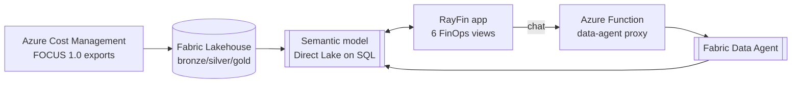

# Azure Cost Analyzer — FinOps app on Microsoft Fabric

A deployable **FinOps analytics app** built on **Microsoft Fabric (RayFin)** that turns your Azure
cost data — conformed to the **FOCUS 1.0** specification — into clear, everyday answers, plus a
**FinOps Assistant** you can just ask in plain language.

> 🎥 **Demo video:** _<add your uploaded demo video URL here>_
> 🔒 **Credential-free by design** — no workspace/model IDs, tenant, endpoints, or keys are committed.

---

## The problem

Every month, the Azure bill arrives — and the room goes quiet. It's bigger than last month, but
**nobody can fully explain why, who owns it, or what to do about it.** The answers are in the data,
buried in raw billing exports that only a spreadsheet expert can decode — so the questions that
matter most go unanswered:

- **Who owns this spend?** Much of it is **untagged**, so it can't be charged back to a team or project.
- **Why did it change?** Real **usage**, or just a price **rate** change? No one's quite sure.
- **Where can we save?** Commitments, waste, and anomalies hide in plain sight.

Cloud cost shouldn't be a mystery. **Azure Cost Analyzer turns raw billing data into clear answers
in seconds** — attribute every dollar, explain every change, surface every saving — and lets anyone
just *ask*.

## Who it's for

- **FinOps practitioners** running showback / chargeback and tagging governance.
- **Finance / CFO stakeholders** who need a trustworthy monthly cost narrative.
- **Platform / cloud teams** who own Azure spend and want to act on it.

## What we built

A single app (React + Vite on **RayFin**) that reads a **Direct Lake** semantic model **live** and
delivers six connected experiences:

| View | What it answers |
|---|---|
| **Executive Summary** | 12-month spend scorecard — total spend, savings %, untagged, monthly trend. |
| **Explorer** | Slice by service / subscription / region; "what changed" splits **usage vs. rate**. |
| **Unusual Spend** | Day-level anomalies vs. a 7-day baseline, before they hit the invoice. |
| **Chargeback** | Allocate cost by tag — see who owns which spend. |
| **Action Center** | Governance of untagged resources, with deep links straight to the Azure portal. |
| **FinOps Assistant** | Plain-language chat **grounded on a Fabric Data Agent** (via a fixed-identity Service Principal proxy). |

Data is FOCUS 1.0-conformed in a Fabric **Lakehouse** (bronze → silver → gold) and surfaced through
a **Direct Lake on SQL** semantic model. The app runs on synthetic demo data **or** a customer's real
Cost Management FOCUS exports — it binds the model through an `aca` alias, never a hard-coded ID.

## Architecture

End-to-end design in **[docs/ARCHITECTURE.md](docs/ARCHITECTURE.md)**; the model contract (tables,
measures, relationships) in **[docs/SEMANTIC-MODEL.md](docs/SEMANTIC-MODEL.md)**.



## Deploy it

Stand up the full demo (Lakehouse → notebook → semantic model → app) from zero in your own Fabric
workspace with **[docs/DEPLOYMENT.md](docs/DEPLOYMENT.md)**. The FinOps Assistant backend is covered
in **[app/functions/data-agent/README.md](app/functions/data-agent/README.md)**.

## Tech stack

- **Microsoft Fabric** — Lakehouse (Delta, FOCUS 1.0), **Direct Lake on SQL** semantic model, **Data Agent**.
- **RayFin (Fabric Apps preview)** — React 19 + Vite + TypeScript + Tailwind v4, live DAX over the model.
- **Azure Function (Python)** — Data Agent proxy over MCP with a fixed-identity Service Principal.

## Repository layout

```
azure-cost-analyzer-app/
├── app/                 # the deployable RayFin app (React + Vite + TS) + data-agent Function
│   ├── src/             #   the six FinOps views + DAX builders
│   ├── functions/       #   data-agent proxy (Azure Function, Python)
│   └── sample-data/     #   synthetic FOCUS dataset + notebook that builds the model
├── docs/
│   ├── DEPLOYMENT.md    # from zero → published app
│   ├── ARCHITECTURE.md  # end-to-end system design
│   └── SEMANTIC-MODEL.md# tables / measures / relationships the app requires
├── scripts/bootstrap.ps1
├── *.example            # config templates (copied to git-ignored real config)
├── SECURITY.md · LICENSE
```

## Security

Everything environment-specific is **externalized** and git-ignored (`app/fabric.yaml`, `.env.local`,
`rayfin/rayfin.yml`, generated bindings). See **[SECURITY.md](SECURITY.md)**.

## Team

Built by the **Microsoft CSA México** team:
**Víctor Santana · Rodrigo Rodríguez · César Martínez · Sebastián Adán**

## License

[MIT](LICENSE).
