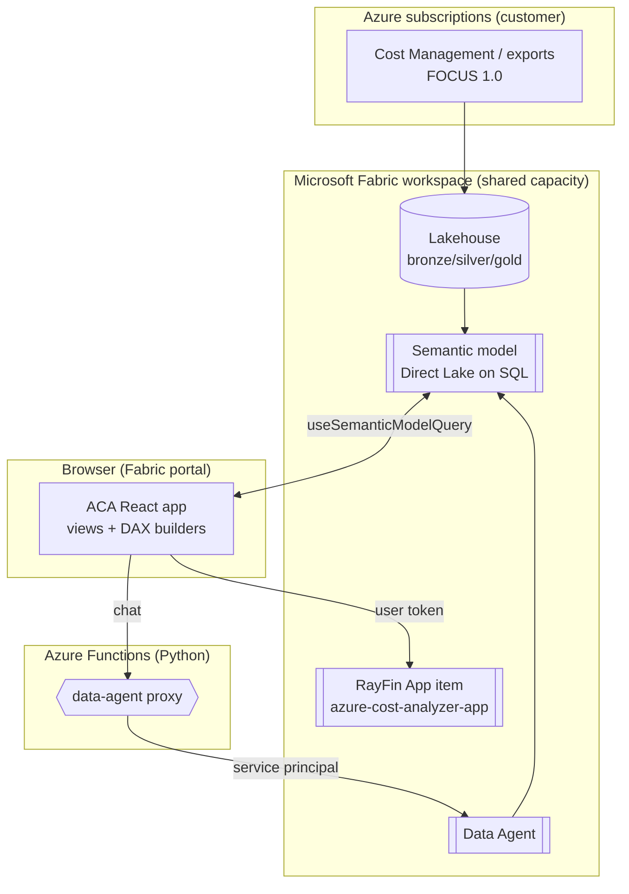

# ACA — Architecture

## End-to-end

## Layers

| Layer | Tech | Notes |
|---|---|---|
| Data | Fabric **Lakehouse** (bronze→silver→gold), FOCUS-conformed | Real exports (**prod**) **or** the synthetic **sample dataset** (**demo**). |
| Model | Power BI **semantic model**, **Direct Lake on SQL** | Contract in [SEMANTIC-MODEL.md](SEMANTIC-MODEL.md). App binds via the `aca` connection alias. |
| App | **RayFin** (React 19 + Vite + TS), Tailwind v4 | Static SPA; reads the model live with DAX. Runs inside the Fabric portal with the user's identity. |
| Backends | **Azure Function** (Python) | `data-agent proxy` — calls the Fabric Data Agent with a fixed-identity Service Principal. No secrets in the browser. |
| AuthZ | User identity + model **RLS** | The app reads the model as the signed-in user; row-level security is enforced at the semantic-model layer. |

## Data flow per view

- **Executive Summary / Explorer / Unusual Spend / Chargeback** → pure read: DAX builder →
  `useSemanticModelQuery` → semantic model (Direct Lake).
- **Action Center** → read-only governance recommendations (untagged resources, with deep links to the Azure portal).
- **FinOps Assistant** → `askAgent()` → data-agent proxy Function → Fabric Data Agent → model.

## Environments (POC / demo / customer)

Everything environment-specific is **externalized** (see [SECURITY.md](../SECURITY.md)):

- `fabric.yaml` (app root) → which workspace + model the app reads.
- `.env.local` → Function URLs/keys, role override.
- The **sample dataset** makes a brand-new workspace demo-ready in minutes (see [DEPLOYMENT.md](DEPLOYMENT.md)).

To stand up a new environment: create workspace → load sample dataset into a Lakehouse → deploy the
semantic model → `rayfin up` the app → set `fabric.yaml` + `.env.local`.

## Relationship to the Azure Cost Analyzer accelerator (separate repo)

The broader **[Azure Cost Analyzer accelerator](https://github.com/victormspg/azure-cost-analyzer)** —
which enables the Cost Management **FOCUS export**, runs the **medallion pipeline** (notebooks
`00`–`09`), and builds the **Direct Lake semantic model** and **Data Agent** — lives in its
**own repo** and is deployed separately.

This RayFin/Apps expansion produces reusable components that **graduate into / enrich** that
accelerator:

- the **RayFin app** (these views over the semantic model),
- the **semantic-model contract** ([SEMANTIC-MODEL.md](SEMANTIC-MODEL.md)),
- the **sample dataset + model notebook** ([deployment guide](DEPLOYMENT.md)) for POC/demo,
- the **Data Agent proxy Function** that grounds the FinOps Assistant.

The accelerator stays the source of truth for the *real* export + daily pipeline + semantic model; this repo
is the **app/experience layer** and the **demo-in-a-box** path that feeds components back into it.
